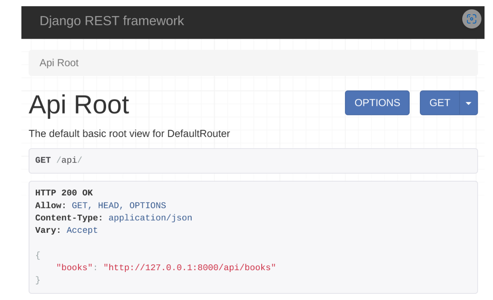

# Different Types of  routing in DRF

# Introduction 

```markdown
The Django REST framework provides different ways of URL mapping or routing in an API project. Besides the traditional style of routing, there are other routing techniques that can save you time while developing.

Note: All the routings should be done in the urls.py file in your Django app.
```

# Regular routes
-It maps a function from a views.py file to an API endpoint
```python

from django.urls import path
from . import views
urlpatterns = [
	path('books’,views.books) ,
]

```
- This URL pattern maps the books function to the /api/books endpoint.
@api_view([‘GET’,’POST’])

# Routing to a class method

```markdown
If you map a specific method from a class, then you need to declare that method as a @staticmethod first. After that, you can map it in the urls.py file. Here’s an example of a class in the views.py file.
```
```python
class orders():
    @staticmethod
    @api_view()
    def listorders():
        return Response({'message': 'list of orders'}, 200)
    
```
#### mapping this listOrders method in the urls.py file :
```python
from django.urls import path
from . import views
urlpatterns = [
	path('orders', views.Orders.listOrders)
]   
```
## Routing class-based views

```markdown
You can save a lot of time in DRF by mapping a class that extends the APIview. You don’t need to individually map every method of such classes.
When a class extends APIview or generic views, you can simply map those classes in the urls.py file.
```

# class  extending the APIView.

```python
class BookView(APIView):
	def get(self, request, pk):
    	return Response({"message":"single book with id " + str(pk)}, status.HTTP_200_OK)
	def put(self, request, pk):
    	return Response({"title":request.data.get('title')}, status.HTTP_200_OK)

```
#### And To map this class in the urls.py file. map the class as a view against an endpoint.

```python
from django.urls import path
from . import views
urlpatterns = [
    path('books/<int:pk>',views.BookView.as_view())
]  
```

- Now you can make HTTP, GET and PUT calls to the /api/books/{bookId} endpoint without issues. If the class has post(), delete() and patch() methods, it will work with HTTP POST, DELETE and PATCH methods too.

# Routing classes that extend viewsets

these classes extend the different types of ViewSets in your API project
example of a typical classextends the viewset.Viewset class.

```python
Class BookView(viewsets.ViewSet):
	def list(self, request):
    	return Response({"message":"All books"}, status.HTTP_200_OK)
	def create(self, request):
    	return Response({"message":"Creating a book"}, status.HTTP_201_CREATED)
	def update(self, request, pk=None):
    	return Response({"message":"Updating a book"}, status.HTTP_200_OK)
	def retrieve(self, request, pk=None):
    	return Response({"message":"Displaying a book"}, status.HTTP_200_OK)
	def partial_update(self, request, pk=None):
        return Response({"message":"Partially updating a book"}, status.HTTP_200_OK)
	def destroy(self, request, pk=None):
    	return Response({"message":"Deleting a book"}, status.HTTP_200_OK)
```
# map this class in the urls.py file 

```python
urlpatterns = [
	path('books', views.BookView.as_view(
    	{
        	'get': 'list',
        	'post': 'create',
    	})
	),
    path('books/<int:pk>',views.BookView.as_view(
    	{
        	'get': 'retrieve',
        	'put': 'update',
        	'patch': 'partial_update',
        	'delete': 'destroy',
    	})
	)
]

```
```diff
After this mapping, you can access the  http://127.0.0.1:8000/api/books  endpoint with GET and POST methods. While you can access the http://127.0.0.1:8000/api/books/1  endpoint with GET, PUT, PATCH and DELETE.
```

# Routing with 'SimpleRouter class' in DRF
If you have a class that extends ViewSets then you can use different types of built-in routers to map those classes in your urls.py file.
using this you don’t have to map the individual methods as you did in the previous section
Initiate a SimpleRouter object and map the class in the urls.py file in your Django app as follows.

```python
from rest_framework.routers import SimpleRouter
router = SimpleRouter(trailing_slash=False)
router.register('books', views.BookView, basename='books')
urlpatterns = router.urls
```

- since you don’t want a trailing slash at the end of your API endpoints, you have to pass 'trailing_slash=False' argument. 

# 
# Routing with DefaultRouter class in DRF

```markdown
There is another type of router called 'DefaultRouter' which provides an extra benefit over the SimpleRouter. It creates an API root endpoint with a trailing slash that displays all your API endpoints in one place. You can use it this way in the urls.py file. 
```

```python
from rest_framework.routers import DefaultRouter
router = DefaultRouter(trailing_slash=False)
router.register('books', views.BookView, basename='books')
urlpatterns = router.urls
```
- Again, after mapping, you can access the api/books and api/books/1 endpoints with the same methods as in the previous examples.

##### Additionally, you can access the API root view when you visit the http://127.0.0.1:8000/api/ endpoint. This will display all the available endpoints as in the screenshot below.



# Simple Router class vs Default Router class

| **Router**         | **Description**                                                                                                                                                     |
|--------------------|---------------------------------------------------------------------------------------------------------------------------------------------------------------------|
| **DefaultRouter**  | Automatically generates a root API view that includes links to all registered viewsets, even when `trailing_slash=False` is used. `trailing_slash=False` affects only the individual endpoints, not the root API view. |
| **SimpleRouter**   | Does not generate a root API view by default. When `trailing_slash=False` is used, it affects the visibility of the endpoints as expected, hiding all endpoints.                                           |
