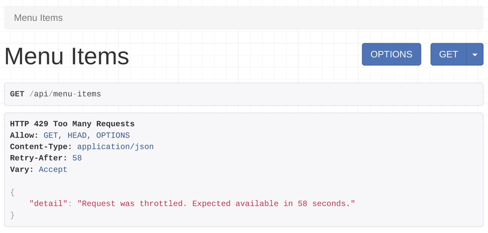

# 
# Setting up API Throttling
- Implement API Throttling or Rate limiting in your Project
- Perform the API Throttling

### Type of Throttling 
    - Annoymous throttling For unauthenticated Users
        - this will be used when there is no API Token in the headers 
    - User Throttling for Authenticated Users
        - It will be used for the valid api token

# Seetings.py to enabling the throtteling
```py
REST_FRAMEWORK=
{

 'DEFAULT_THROTTLE_CLASSES': [
        'rest_framework.throttling.AnonRateThrottle',
        'rest_framework.throttling.UserRateThrottle'
    ],
    'DEFAULT_THROTTLE_RATES':
    {
        'anon': '5/minute',
        'user': '10/day'
    },
```

# Views.py for auth and annoymous throttling
```py

# Views for the Throttle Check 
from rest_framework.throttling import AnonRateThrottle
from rest_framework.decorators import throttle_classes

@api_view()
@throttle_classes([AnonRateThrottle])
def throttle_check(request):
    return Response({'message': "Successful"})

# fro the authenticated user
@api_view()
@permission_classes([IsAuthenticated])
@throttle_classes([UserRateThrottle])
def throttle_check_auth(request):
    return Response({'message': "Successful"})
```

# Custum Throttling limit rate for the Authenticated Users
```py
from rest_framework.throttling import UserRateThrottle

# this class sets the new throttling policy for the user as the default throttling rate 

class TenCallsPerMinute(UserRateThrottle):
    # rate = '10/m'
    scope = 'ten'

# add in the settings.py 
# 'ten': '10/minute' 
```


#
# API throttling for class-based views
- To quickly implement throttling in class-based views.
- How real-world services use this API throttling to protect their API endpoints from abuse.

Use a class-based view to extend the ModelViewSet to quickly implement a functional CRUD API endpoint for the menu items. To create this class-based view add these lines in the views.py file.
```py
from rest_framework.response import Response from rest_framework import viewsets from .models import MenuItem from .serializers import MenuItemSerializer
class MenuItemsViewSet(viewsets.ModelViewSet):
    queryset = MenuItem.objects.all()
    serializer_class = MenuItemSerializer
```
Open the urls.py file and map this MenuItemViewSet class to the menu-items API endpoint. Map only the GET methods.

```py
from django.urls import path 
from . import views 
urlpatterns = [ 
    path('menu-items',views.MenuItemsViewSet.as_view({'get':'list'})),
    path('menu-items/<int:pk>',views.MenuItemsViewSet.as_view({'get':'retrieve'})),
] 
```
Now you can list all menu items by visiting http://127.0.0.1:8000/api/menu-items and any single menu item by visiting http://127.0.0.1:8000/api/menu-items/1.


### Add support for throttling  
DRF comes with excellent throttling classes that you can use straight out of the box. To do this, add the following lines in the settings.py in the REST_FRAMEWORK section.
```py
'DEFAULT_THROTTLE_CLASSES': [
        'rest_framework.throttling.AnonRateThrottle',
        'rest_framework.throttling.UserRateThrottle'
],
```

### Throttling for class-based views

Class-based views don’t use the throttle_classes decorator like function-based views. To use throttling, you need to pass the throttle classes to a public class property called throttle_classes. First import the necessary classes in the views.py file.

Then create a public property called throttle_classes with either one or both of these two classes, UserRateThrottle or AnonRateThrottle. 

```py
from rest_framework.throttling import UserRateThrottle, AnonRateThrottle
class MenuItemsViewSet(viewsets.ModelViewSet):
    throttle_classes = [AnonRateThrottle, UserRateThrottle]
    queryset = MenuItem.objects.all()
    serializer_class = MenuItemSerializer
```
Now the menu-items API endpoints will be throttled for both anonymous and authenticated users. You can define the throttling rate for both in the settings.py file. 

```py
'DEFAULT_THROTTLE_RATES': {
        'anon': '2/minute',
        'user': '10/minute'
}
```
To test if the throttling is working properly, go to the http://127.0.0.1:8000/api/menu-items endpoint three times. After the second visit, the client will see an error message. 


# Conditional throttling
It’s very easy to implement conditional throttling in class-based views. With conditional throttling, you can throttle API endpoints only for the specific HTTP methods, like GET calls, or POST calls.

For example, you can have conditional throttling that throttles POST calls, but not GET calls. You can do this by overriding the get_throttles method. In a class-based view that extends a ModelViewSet class, the POST call is handled by create methods. Similarly, the GET call is handled by the list method. Add the following lines of code to implement conditional throttling in the MenuItemsViewSet class. 

```py
class MenuItemsViewSet(viewsets.ModelViewSet):
    queryset = MenuItem.objects.all()
    serializer_class = MenuItemSerializer
 
    def get_throttles(self):
        if self.action == 'create':
            throttle_classes = [UserRateThrottle]
        else:
            throttle_classes = []  
        return [throttle() for throttle in throttle_classes]
```

this checks if the router called the create action, which handles the POST request. If that action is called, implement the throttling class UserRateThrottle. The POST calls will be limited to 10 calls per minute to this menu-items endpoint. 

# Custom throttling classes
You can use the custom throttling classes you created earlier in the course, like TenCallsPerMinute in the throttles.py file. All you have to do is import this class and then add it in the throttle_classes attribute, and you are done. 

from .throttles import TenCallsPerMinute
throttle_classes = [TenCallsPerMinute]

# Real world examples of API rate limits
Here are some popular services and their current rate limit. This can help you to get some idea of how others are using such features in their API projects.

| Service                  | Anonymous | Authenticated | Rate           |
|--------------------------|-----------|---------------|----------------|
| Facebook graph API       | X         |               | 200/hour       |
| Instagram API            | X         |               | 200/hour       |
| Instagram messenger API  | X         |               | 100/second     |
| WhatsApp messaging API   | X         |               | 80/second      |
