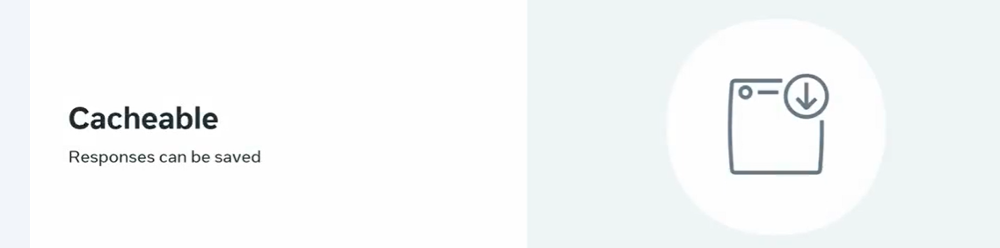
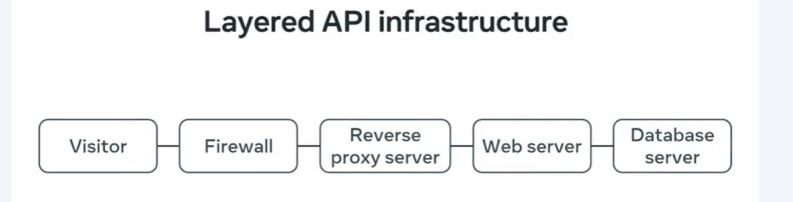
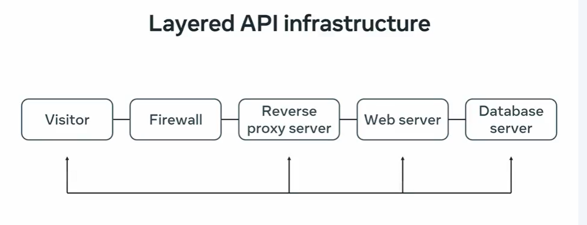

#
# Caching
- Caching save the result instead of creating or fetching new one 

- REST API should be cacheable 
- REST API is a Layered Architecture and System split into the layers

# Layerd API Infrastructure 

# Caching in the Rest APIs
- Caching can be done in the client , reverse Proxy, Web Server , DataBase Server 

# 1. Role Of the Database Layer Caching 
- Most DBs do the Caching to prevent Excessive read write operations in the storage
- Uses the Query Cache ( Which store the SQL Queries and Result in the memory)
- This saves the processing power and time 

- Can't only rely on the DB caching bcz from the server side scripts still connecting the dbs every time and this can be limited  by connections , ram and cpu

# 2. Caching the Server
- cache the data by script 
- This cache the data/result in the seprate storage like Simple file, in a database, Caching tools : Redis , Memcached

- so this caching can save you to connect the db every time

### Connect the DB one time and cache it for number of requests

- As the web servers has the limit to respond the active requests , The Reverse Proxy Caching can be utilized

# Reverse Proxy Caching 
- Caching heavy servers use the reverse proxy to distribute the request on servers evenly 

# Client Side Caching 

- reverse proxy or webserver send the caching headers to instruct the client to cache the result for the specific time 

- during this caching the client decides to do one of the below thing

