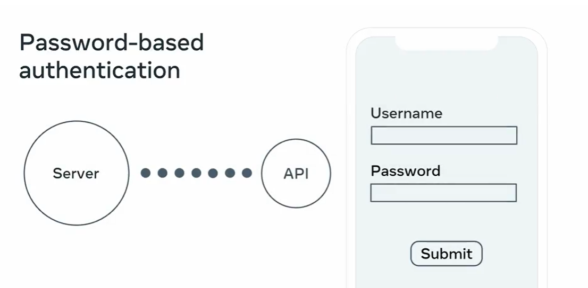
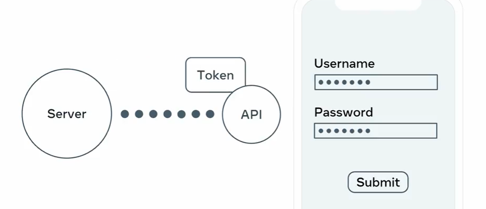

#
# DRF Security

# Password Auth

# Token Based Authentication
- In this if the user is authenticated the server generates the token 
- This token is combination of Long char , Hard to read , and Aplhanumerical char, symbols
- So when new API request is send the token is included in the Headers
- server side method TokenAuthentication class validate the token and match with the user 

# settings.py
- add the rest_framework.authtoken  in the installed app section 
- pipenv shell
- run migrations for the auth token app

- create the superuser
    - python manage.py createsuperuser
    
