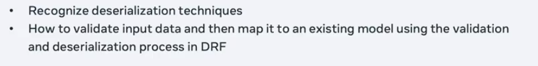

#
# Deserialization and Validation

- #### Deserialization is the process of converting the JSON data into a Django object.
- #### Validation is the process of checking if the data is valid or not.

# views.py
- ### [Deserilaztion views](/DRF_RestroAPI/LemonRestro/LemonAPI/views.py)
