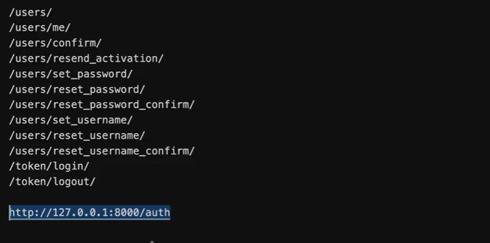

#
# Djoser library for better authentication

# Install Djoser
pipenv install Djoser

- add the app in the installed app keep it after the rest_framework
'djoser',

# Create the filed in settings.py

```PY
DJOSER = {
    "USER_ID_FIELD":"username",
    # "LOGIN_FIELD"
    # USE ANY ONE
}
# add the seesion authenticatin for the djanog admin use simulatenouly, and can be removed for the production

'DEFAULT_AUTHENTICATION_CLASSES':
    [
        'rest_framework.authentication.TokenAuthentication',
        'rest_framework.authentication.SessionAuthentication',
    ],
```

# Enable the Djoser in the Main Urls.py file
```py
urlpatterns = [
    path('admin/', admin.site.urls),
    path('api/',include('LemonAPI.urls')),
    path('auth/', include('djoser.urls')),
    path('auth/', include('djoser.urls.authtoken')),
]
```
# Djosers API End Points Support 



# Note:
Using Djoser you can set either the user ID or email address as the username.
