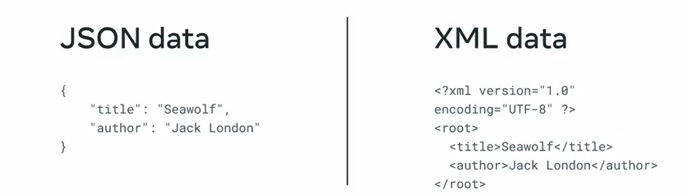
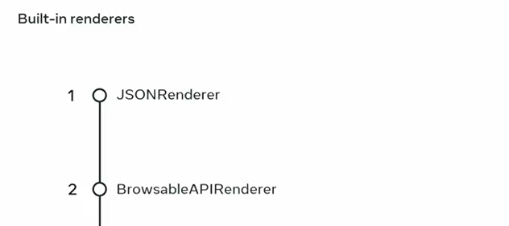
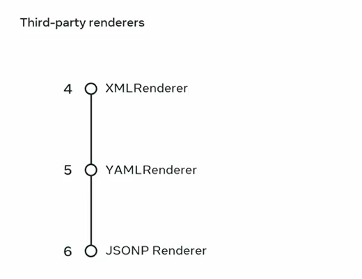
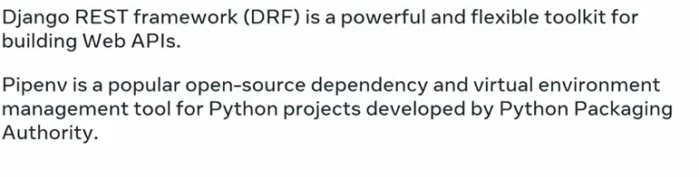

#
# Renderers

- Renderers are responsible for displaying the ouput of the APIs into the different format
like JSON, XML, YAML 



# Built in Renders 


# Third Party Renders 


# Header
```
HEADER
Accept: application:json

```
#### Change the renders in the DRF in the settings.py file
```python
REST_FRAMEWORK = {
    'DEFAULT_RENDERER_CLASSES':
    [
        'rest_framework.renderers.JSONRenderer',
        'rest_framework.renderers.BrowsableAPIRenderer',
        'rest_framework_xml.renderers.XMLRenderer',


    ]
}
```
# Note:
- Browseable API Renderer only works when the the Accept Header is set to the : "text/html"
If you do not send and Accept header, only the JSON output will display.     
```json
OPTIONS /api/menu-items/
HTTP 200 OK
Allow: POST, OPTIONS, GET
Content-Type: application/json
Vary: Accept

{
    "name": "Menu Items1",
    "description": "",
    "renders": [
        "application/json",
        "text/html"
    ],
    "parses": [
        "application/json",
        "application/x-www-form-urlencoded",
        "multipart/form-data"
    ]
}
```

