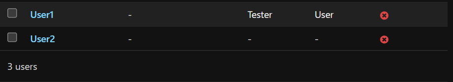

# 
# User Roles

- Creating the User gorups to maintain the User Authentication and AUthorizations

- Add the User 1 in the Manager group and create the User2 without any group


# Creaating the Authorization Layer for the APIs by Using User Groups
- create the Manager view and add the check for the Manager group

```py
@api_view(['GET'])
@permission_classes([IsAuthenticated])
def manager_view(request):
    if request.user.groups.filter(name='Manager').exists():
        return Response({'message': 'This is Manager Auth Class'}, status=status.HTTP_200_OK)
    else:
        return Response({'message':'You are not authorizeed'},status=status.HTTP_404_NOT_FOUND)

# Urls.py
    path('manager-view/', views.manager_view),

```
