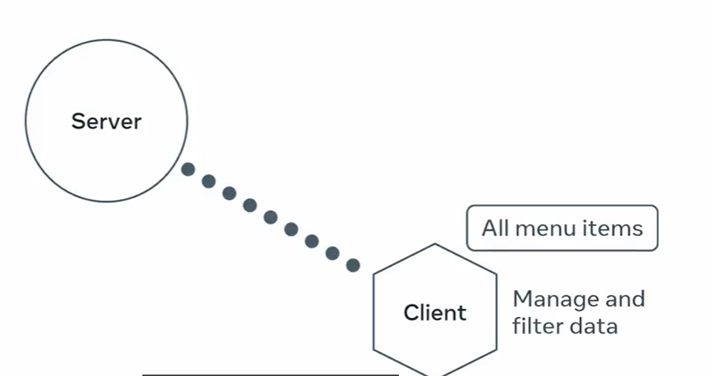
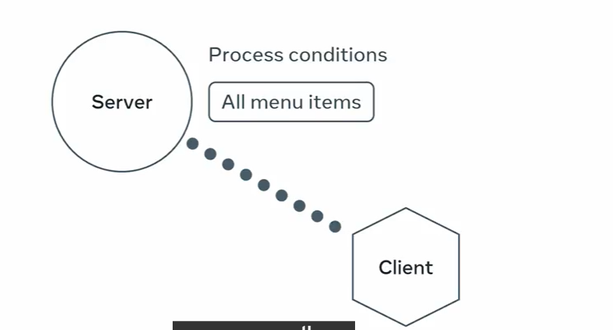

# Searching and filtering in the API Endpoints 

## 1. By Managing and Filtering Data at the Client site


- It can take less time to develop
- #### Tradeoff
    - It will fetch every or all records frmo the database and it can not be sustainable 
    when there is lot of data and can create the load on server 


## 2. By Prcessing the Conditions on the Server Side


- #### Benifits : 
    - When using the Server Process Conditions it will take less time for the loading and fetching
    - bcz only required  the data is fetched after the process of filtering 

#
# Code for filtering , # Searching 
```python
def menu_items1(request):
    if request.method == 'GET':
        items = MenuItem.objects.select_related('category').all()
        #------------------------------------------------------------------#
        # for filtering the items based on category and price and: 
        #------------------------------------------------------------------#
        catgeory_name = request.query_params.get('category')
        to_price = request.query_params.get('max_price')
        seach = request.query_params.get('search')
        if catgeory_name:
            items = items.filter(category__title=catgeory_name)
        if to_price:
            items = items.filter(price__lte=to_price) #  price_lte ==> less than or equal price
        if search:
            items = items.filter(title__icontains=search) # i for case sensitive
            # items = items.filter(title__startwith=search)

        #------------------------------------------------------------------#
        serialized_items = MenuItemSerializer2(items, many=True) # to covert the all the items to json 
        # return Response(items.values()) # for models without serializer
        return Response(serialized_items.data)

# query : http://127.0.0.1:8000/api/menu-items/?max_price=10
```

# 
# Django Filter
- Ordering the API reasult using the sorting result
- Use the DRF Package django-filter for the class based views 

## Using the django native filters for the function based views by @api_view decorators

## sorting :
API endpoint
    - http://127.0.0.1:8000/api/menu-items/?ordering=price

- Ordering in the DESC order:
    - - http://127.0.0.1:8000/api/menu-items/?ordering=-price

- Ordering with multiple fields 
    -  http://127.0.0.1:8000/api/menu-items/?ordering=-price, inventory

```python
def menu_items1(request):
    if request.method == 'GET':
        items = MenuItem.objects.select_related('category').all()
        #------------------------------------------------------------------#
        # for filtering the items based on category and price: 
        #------------------------------------------------------------------#
        catgeory_name = request.query_params.get('category')
        to_price = request.query_params.get('max_price')
        search = request.query_params.get('search')
        ordering = request.query_params.get('ordering')
        if catgeory_name:
            items = items.filter(category__title=catgeory_name)
        if to_price:
            items = items.filter(price__lte=to_price) #  price_lte ==> less than or equal to price
        if search:
            items = items.filter(title__icontains=search) # title_icontains ==> case insensitive search
        if ordering:
            ordering_fields = ordering.split(',')
            #items = items.order_by(ordering)
            items = items.order_by(*ordering_fields) # for multiple ordering fields
```