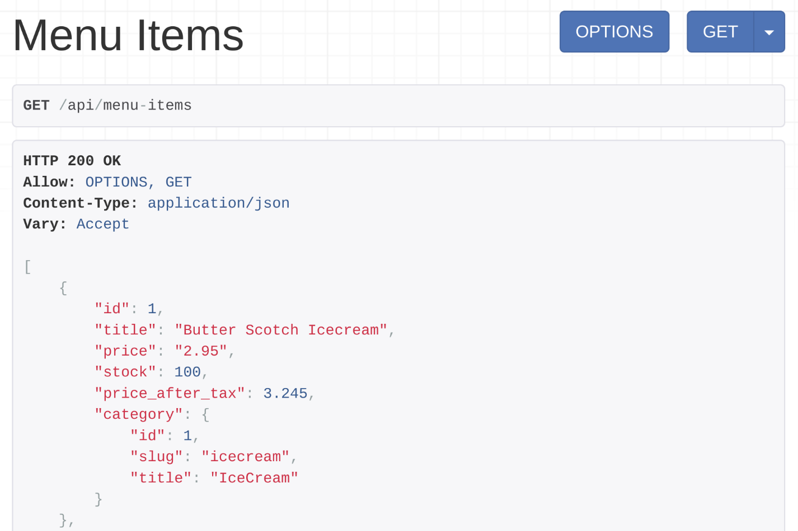
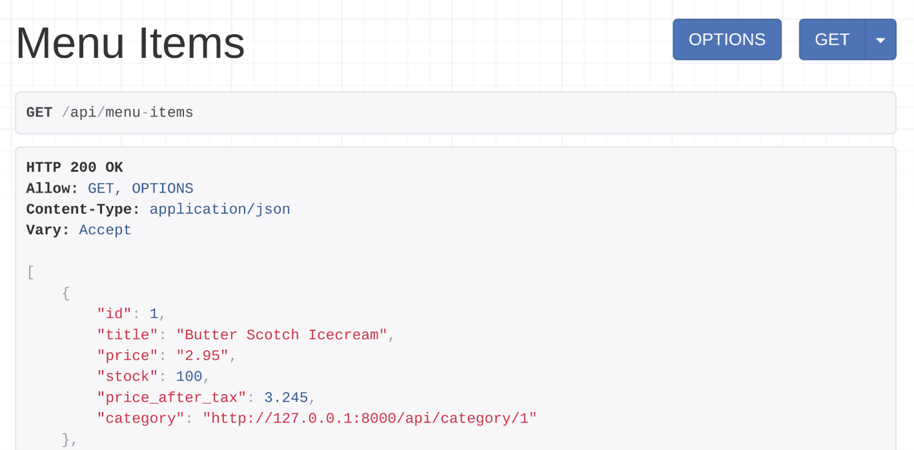
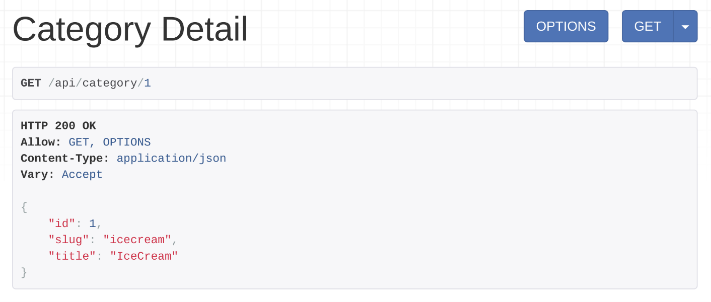

#
# Other types of serializers in DRF

- *Nested fields* how to automatically display a nested model field using the depth option of the serializer. 
- *HyperlinkedModelSerializer* how to display related model fields as hyperlinks by using the HyperlinkedRelatedField.

# Nested fields
If you were to visit the menu-items endpoint, you would note the category displays as a nested field with its id, title, and slug. 



# This can be achieved in two ways.

## Method 1:
The first way to do this is to create a category serializer in serializers.py and include it in the menu item serializer as demonstrated in the code below. 
```python 
from rest_framework import serializers
from decimal import Decimal
from .models import MenuItem, Category 
class CategorySerializer (serializers.ModelSerializer):
    class Meta:
        model = Category
        fields = ['id','slug','title']
 
class MenuItemSerializer(serializers.ModelSerializer):
    stock =  serializers.IntegerField(source='inventory')
    price_after_tax = serializers.SerializerMethodField(method_name = 'calculate_tax')
    category = CategorySerializer()
    class Meta:
        model = MenuItem
        fields = ['id','title','price','stock', 'price_after_tax','category']
    
    def calculate_tax(self, product:MenuItem):
        return product.price * Decimal(1.1)
```
## Method 2:
There is another way of doing this. Instead of declaring the category field as CategorySerializer you can specify that depth=1 is in the Meta class in MenuItemSerializer. This way, all relationships in this serializer will display every field related to that model.  You can change the code of the MenuItemSerializer as below. 

```python

class MenuItemSerializer(serializers.ModelSerializer):
    stock =  serializers.IntegerField(source='inventory')
    price_after_tax = serializers.SerializerMethodField(method_name = 'calculate_tax')
    # category = CategorySerializer()
    class Meta:
        model = MenuItem
        fields = ['id','title','price','stock', 'price_after_tax','category']
        depth = 1
    
    def calculate_tax(self, product:MenuItem):
        return product.price * Decimal(1.1)
```

# Display a related model fields field as a hyperlink 
In DRF you can display every related model field as a hyperlink in the API output. Like this:  http://127.0.0.1:8000/api/category/{categoryId}  for the category field. There are two different ways to do this. The first method is to use the serializer field called HyperlinkedRelatedField and for the second method you use the HyperlinkedModelSerializer.

# Method 1: HyperlinkedRelatedField

### Step 1: Create and map a new view function 

Every HyperlinkedRelatedField field in a serializer needs a queryset to find the related object and a view name that is used to map the hyperlinked URL pattern.

Thus you have to create a new function in the views.py file that will handle the categoryId endpoints.

#### views.py
```python
from .models import Category from .serializers import CategorySerializer
@api_view()
def category_detail(request, pk):
    category = get_object_or_404(Category,pk=pk)
    serialized_category = CategorySerializer(category)
    return Response(serialized_category.data) 
```
#### urls.py
```python
path('category/<int:pk>',views.category_detail, name='category-detail')
```
Tip: There is a convention you must follow when you create this view name. The rule is that you have to add -detail after the related field name, which is category in the MenuItemSerializer. This is why the view name was category-detail in this code. If the related field name was user, the view name would be user-detail. 

### Step 2: Create a HyperLinkedRelatedField in the serializer

The next step is to change the MenuItemSerializer code. The following code sets the category field as a HyperLinkedRelatedField in the MenuItem serializer.

```python
from .models import Category
class MenuItemSerializer(serializers.ModelSerializer):
    stock =  serializers.IntegerField(source='inventory')
    price_after_tax = serializers.SerializerMethodField(method_name = 'calculate_tax')
    category = serializers.HyperlinkedRelatedField(
        queryset = Category.objects.all(),
        view_name='category-detail'
    )
    class Meta:
        model = MenuItem
        fields = ['id','title','price','stock', 'price_after_tax','category']    
    def calculate_tax(self, product:MenuItem):
        return product.price * Decimal(1.1)
```
Note how a queryset and a view name are provided in the category HyperlinkedRelatedField. The code follows the convention so you can remove the line, view_name='category-detail. It is only necessary if you didn’t follow the convention and you created the view name in a different way in the urls.py file. 

### Step 3: Add context
The final step is to add context to the MenuItemSerializer in the menu_items function, as below.


```python
serialized_item = MenuItemSerializer(items, many=True, context={'request': request})
```
- The argument context={'request': request} lets the menu-items endpoint display the category field as a hyperlink.


 You can click on that hyperlink and check the category details. 




# Method 2: HyperlinkedModelSerializer
another way to display a category field as a hyperlink. With this method, you need to change the code in the serializers.py file. so that the MenuItemSerializer extends the serializers.HyperlinkedModelSerializer class instead of the serializers.ModelSerializer class.

```python
class MenuItemSerializer(serializers.HyperlinkedModelSerializer):
    stock =  serializers.IntegerField(source='inventory')
    price_after_tax = serializers.SerializerMethodField(method_name = 'calculate_tax')
 
    class Meta:
        model = MenuItem
        fields = ['id','title','price','stock', 'price_after_tax','category']
    
    def calculate_tax(self, product:MenuItem):
        return product.price * Decimal(1.1)
```
When you use the HyperlinkedModelSerializer the output of the menu-items endpoint produces the same output with a hyperlinked category field like in the screenshot in Method 1 but the code is much cleaner and simpler.

#### Note: When you use a HyperlinkedModelSerializer, you still need the URL pattern with a view name as you did in the previous section. 
```python
urlpatterns = [ 
    path('menu-items',views.menu_items),
    path('menu-items/<int:id>',views.single_item),
    path('category/<int:pk>',views.category_detail, name='category-detail')
]
```


# Note: 
```
GCP Services: Storage, API Gateway, and Functions
Steps:
- Learn about Google Cloud Storage and its functionalities. Focus on data persistence and retrieval.
- Study how API Gateways work, encompassing security, routing, and monitoring. Analyze documentation and example projects.
- Review Google Cloud Functions, understand their deployment and integration. Complete tutorials and practice deploying functions.
- Create a simple application that uses API Gateway and Cloud Storage. Apply this knowledge to practical examples to enhance understanding.
```