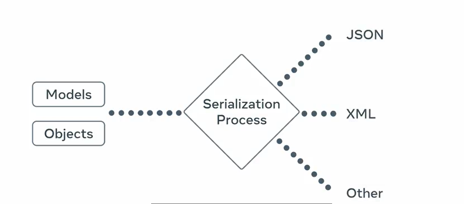
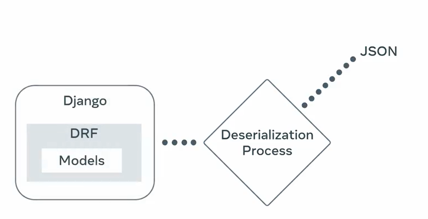
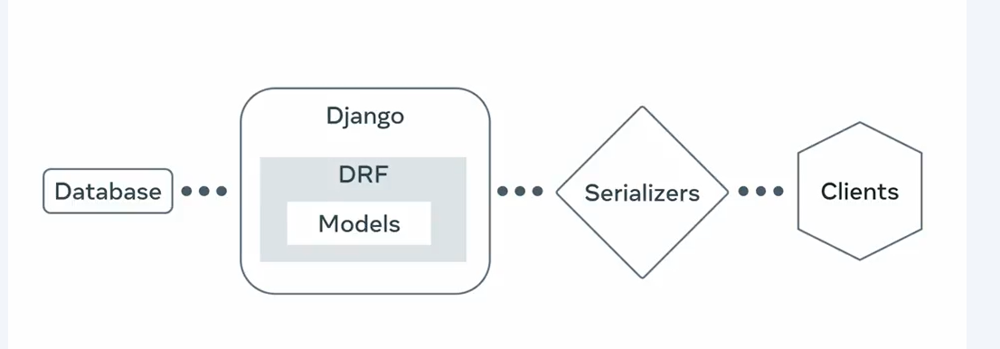
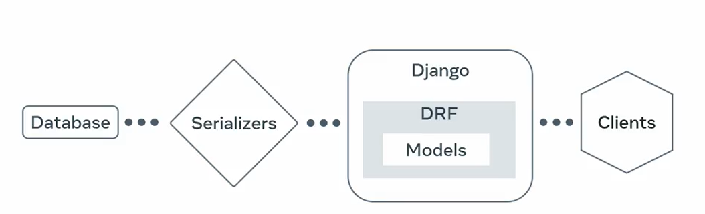

#
# Serializers
- Data Conversions in DRF 

## 1. Serializations : 
    
## 2. Deserialization

-  Data is verified during the deserializatin to ensure the data is consistent and clean
- and prevent the data corruption

- #### Pull data from the database using the Django Models and present to clients using the serializers

#### 2. Convert the User supplied data into Models and store into database
(diagram flow left to right )

