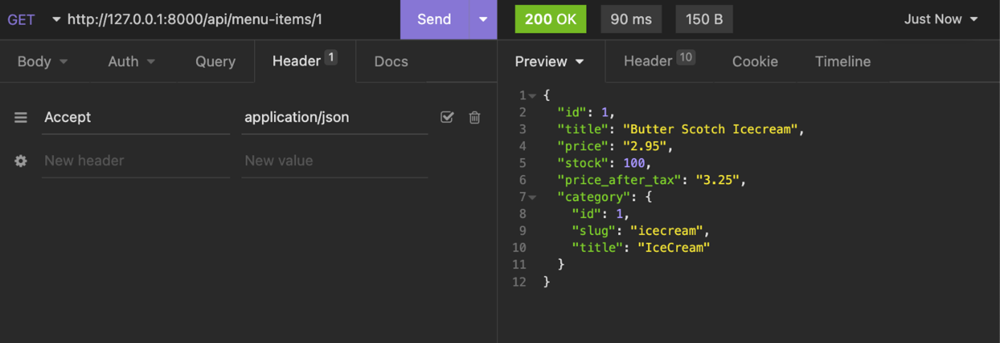

#
# Access Control 


# Roles and Privilege:


### Example 

#### Customer Role 


#### Manager Role


#### Delivery Crew Role


### Types of Roles 


# Authentication and Authorization 

# Authentication
```
Authentication is the process of verifying the credentials of a user. Logging into websites with a username and password is a typical example of authentication. 
The website recognizes the user and sets some cookies in the user’s browser.
When the user visits another page on that website, the browser sends those cookies within the HTTP request header.

```


# Token Based Authentication :
usually it involves two steps:
1. First, the client identifies itself with a username and password. 
2. Then the API server gives it a bearer token.
From there, the client includes the bearer token with every API call that it places

Authentication process: Getting an access token


Authenticated API calls

If the credentials are not valid, the client will receive a 401 - Unauthorized HTTP status code.

# Authorization 

```
Authentication lets you in, authorization lets you act. It checks after authentication if the user has the proper privileges to perform some tasks. 

On the server side, this is typically done by assigning the user to a group or a set of groups. Then, after verifying the token, the code checks if the user belongs to the appropriate group to perform that task. If not, the client will receive a 403 - Forbidden HTTP status code.
```


# Implementing authorization 

Privileges are the tasks that an API user performs, and they are the building blocks of an authorization layer. First, as an API developer, you identify the required privileges in your project. For example, for a bookshop, there might be the following types of privileges:

# User groups in Django

The Django admin panel comes with excellent support for the user group system. If you log into the admin panel, you will find two distinct sections – users and groups.


