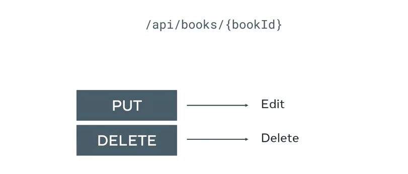

# Book List Website API requirements

### 1.  API Features or scope
### 2. Django Model
### 3. EndPoints
### 4. Different Response 
### 5. JSON Response 
### 6. Edit, Delete , Request ,
### 7. Query Dict Request 

# 1.  API Features or scope
- 1. 


- 2.
 

#### To Store the data : 
1. Table in db
2. Django Model that define how data is stored in table 

# 2.  Django Model : 

1. Title : charfield - max 255
2. Author: Charfield - max 255
3. Price : Decimalfield - 5 digit 2 decimal places 
4. Inventory: Integerfield (status if book is in stock or not)

#  3. API End Points 

1. api/books     ---- Deliver all the books in db (Available or not )
2. api/books{bookID} ----- (deliver the particular book) --- If not deliver 404 not found , 200 Success 

### Result for the single book which contain multiple fields 


# 4.  Response 

#### Successful  Request 


#### Handle the missing field 


# 5. JSON Response

### Converting the Single Model Response into JSON form 


# 6 Edit and Delete the books



#### create the URL Pattern in Django to delete and create
```
-- URL Pattern 

api/books/<int:pk>

```

# Note: 

```
Data (Payload) is passed in the HTTP request in the :
1. Raw Json string
2. Form URL encoding string 

```


# 7. Query Dict 

### To access the  element from json parse the String 
```
To access individual data elements from a JSON response, you use the QueryDict class from the Django.http module which will parse the request body to a Python dictionary.
```
