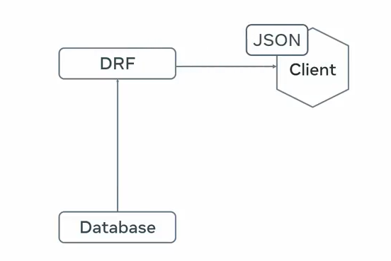

#
# DRF
- It is a toolkit that speeds up API Development 

#### Data Types
Data types like JSON, XML needs be deal using the DRF 

# Serialization

- Using the DRF we don't need to worry about the tranforming the Database Model into Restful API
