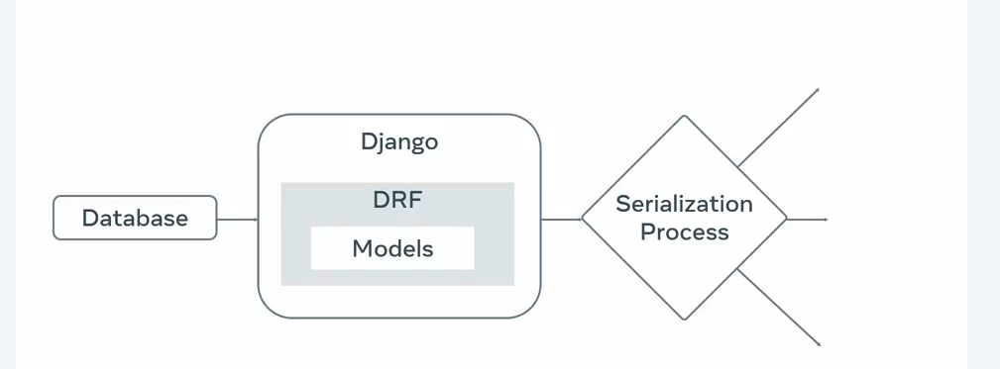
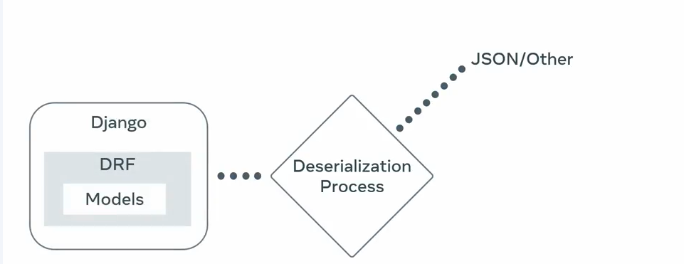
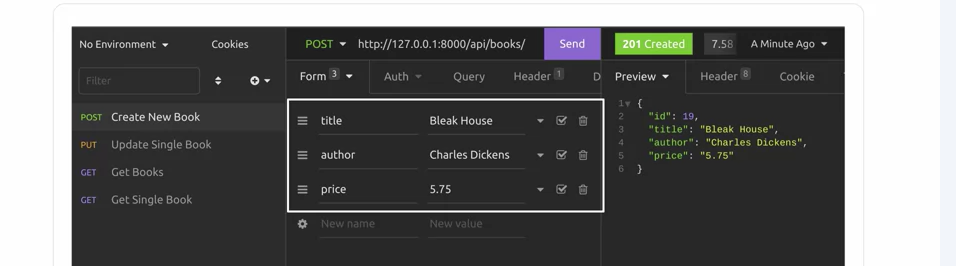

#
# REST API client Insomnia to make HTTP Requests

## Create a GET request

```
Open the 
https://httpbin.org/
 website and click on HTTP Methods. A menu with different HTTP methods will expand which you can add to your endpoints.

``` 


- Step 1:
In Insomnia, click on the + icon on the left-hand side of the screen and select HTTP Request from the drop-down menu.

- Step 2:
Double-click the request to change its title to GET request using Insomnia. 

- Step 3: 

Click on the GET dropdown to see a list of available options and re-select GET. 

Update the URL endpoint with the value: 
https://httpbin.org/get
  
Press the Send button and notice the JSON output. 

```
Raw Data
{
	"args": {},
	"headers": {
		"Accept": "*/*",
		"Host": "httpbin.org",
		"User-Agent": "insomnia/10.3.0",
		"X-Amzn-Trace-Id": "Root=1-6778170e-60d6fbb824f667945e4f1c73"
	},
	"origin": "119.235.51.211",
	"url": "https://httpbin.org/get"
}

```
- Step 4:
From the Body drop-down option, select Multipart Form. 

Add the following values under New name and New value:

New name: title
New value: Lord of the Rings
 Press the Send button once again and observe the changes.  

- Step 5: 
Update a form entry with the following details:

New name: author

New value: JRR Tolkien            

Press the Send button once again. Notice that Content-Length has further been updated. 


Step 6: 
```diff
You can Filter your output using the Filter response body at the section in the bottom right-hand side of Insomnia as indicated in the screenshot below. 
```
Filter functionality in Insomnia


```
- Add the following filter inside it: $.origin

It should update the Preview. The output will appear similar to what is displayed in the screenshot below.
```


- Step 7: 
Modify the filter incrementally as below which should produce the respective outputs.
```
 $.headers
```



```
$.headers.Content-Type
```
[
	"multipart/form-data; boundary=X-INSOMNIA-BOUNDARY"
]

~~~
Note: The dot operator is used here to explore the contents of the JSON output. Also notice the value of the Content-Type is form-data because you selected Multipart form. 

 Clear the contents of the Filter response body. 
~~~ 

- Step 8:
Now deselect the option for the name title and re-create the GET request.

Notice the change in the Content-Length again.

- Additional step

```
Now that you know the steps to create a GET request in Insomnia, you can explore different configuration settings by following the steps discussed to get more accustomed to the tool.
```

#
# Create a POST request with Form Data

- Step 1:
```
Keeping the contents of the form data the same, update the request type to POST and update the URL endpoint to:

https://httpbin.org/post

```

Notice that the contents of the form are updated inside the output for the POST request. 


- Step 2:
Explore the other tabs under the output such as Headers, Cookies and Timeline.



Step 3:      
Since you have modified the same HTTP request, update the changes for the title of the request in the left-hand section to POST request using Insomnia.

New title of the POST request in Insomnia
Create a POST request with JSON Data
 Step 1:
Now further create another HTTP Request like the one at the beginning by pressing the + icon and selecting HTTP Request. 

Step 2:
Update the request type to POST and the request label as:

POST request using JSON object

Note: The labels are for reference and independent of the request type.

Paste the same URL endpoint that you used earlier in the URL text-box:

https://httpbin.org/post

The updated view should appear as below:

Insomnia with two POST requests appearing in the left-hand pane


- Step 3:
```
Under the Body dropdown option, select JSON as the text input.

JSON is an option under the text input section in the dropdown menu of the Body option.

A text input area should appear as below.
```



Step 4:
Enter the following content inside the text input area:
```

{
            "title": "Lord of the Rings",
            "author": "JRR Tolkien",
            "published" : {
                        "year": 1954,
                        "month": "july",
                        "day" : 29
            }
}

```
Press the Send button. 

The output for the JSON input should appear as below: 

```
Output of a POST request with JSON set as the text input.
Notice the contents entered as JSON object in both the data and json field inside the JSON output. 
```

- Step 5:

Add the following line to Filter response body:

$.json.published.year

The output will be as follows:
```
[
	1954
]
```

- Modify the Filter response body as follow:

 $[json][published][day]

 The output will be as follows:
```
[
	29
]
```
There are several configuration options inside Insomnia. While using a REST API client it is good to explore these. 