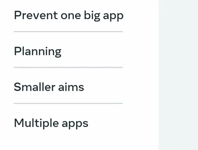
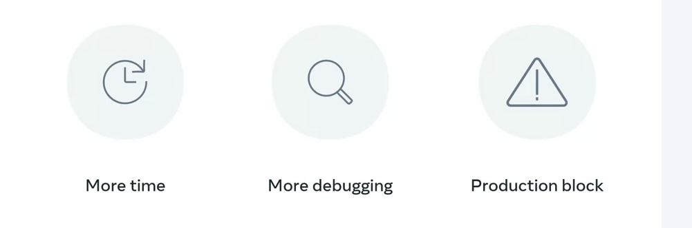
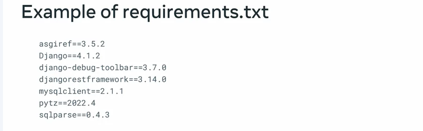
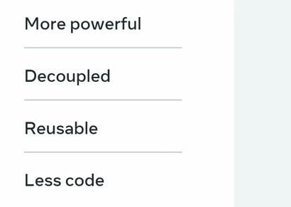
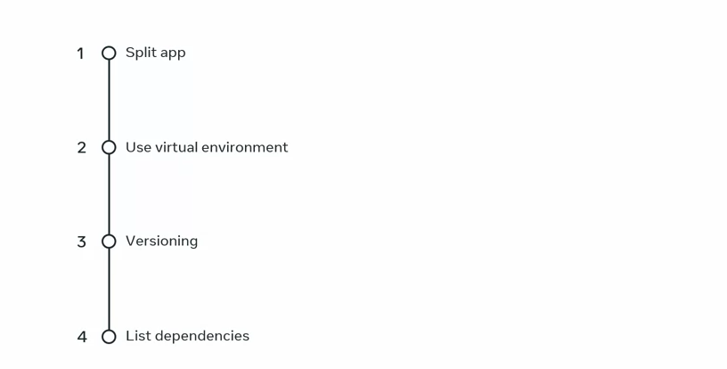
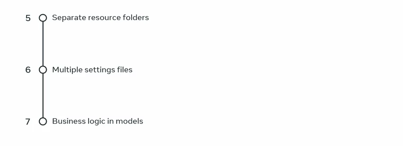

#
# Organizing the API Porject 


```
Spliting the Big App into the multiple apps means Decoupling apps as much as possible and each app dealing with the particular set of relevent problems.

```


### Disadvantes of the Adding the every feature in one App


## Multiple Apps Management

1. Avoid the Global Environment use for project dependencies
2. Using the Global envs creates the Conflicts for packages and issues 
3. Always use the virtual environments to isolates the dependencies
  Example: Use Pipenv  
4. Use versioning Bcz the Upgrades might break the apps bcz result of the new api might be different 


5. List your dependencies in the separate requirements.txt files 



- For the pipenv , no need the requirement file as it automatically creates and manages piplock file


6. Must Have the Separate resource folder for the each APP:
    - to avoid conflicts 
    - Easily Manages 

7. Split the settings into multiple settings files
    - can use the Django Split Settings 
8. Plcae the Business Logic in models instead of views

    - Manages and Organize code in one place
    - Advantages  
    


# Summary 


