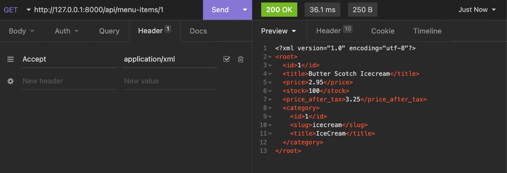

# XML and JSON response types

# 1. Request headers 
```
Client applications need to send Accept request headers with every HTTP request to receive the output in JSON or XML. For example:
```
| Response Type | Request Header            |
|---------------|----------------------------|
| JSON          | Accept: application/json   |
| XML           | Accept: application/xml    |
| XML           | Accept: text/xml           |

- The client can send an Accept header in an HTTP GET request and depending on the request header
# API Request for JSON


# API request XML response



# Data conversion
```
Django REST framework, also called DRF. DRF has built-in renderers that can convert your data to JSON and represent it in an interactive, browsable API viewer.
```
# JSON versus XML

- creating JSON data or parsing it is easier than XML. 
- XML is more readable and supports data attributes that are not possible in JSON.
- you can represent complex data in XML and still keep it readable.

| Aspect                 | JSON                                                                                   | XML                                                                                                         |
|------------------------|----------------------------------------------------------------------------------------|-------------------------------------------------------------------------------------------------------------|
| Data Format            | Lightweight and dependency-free                                                        | Powerful, tag-based, similar to HTML                                                                        |
| Complexity             | Simple, less complex                                                                   | Can be fairly complex                                                                                       |
| Size                   | Smaller, takes less bandwidth                                                          | Lengthier, takes more bandwidth                                                                             |
| Structure              | Key-value pairs                                                                        | Completely tag-based, no key-value pairs                                                                    |
| Example                | {"author": "Jack London", "title": "Seawolf"}                                           | ```<?xml version="1.0" encoding="UTF-8"?> <root> <author>Jack London</author> <title>Seawolf</title> </root>``` |
| Arrays Representation  | {"items": [1,2,3,4,5]}                                                                 | ```<?xml version="1.0" encoding="UTF-8"?> <root> <items> <element>1</element> <element>2</element> <element>3</element> <element>4</element> <element>5</element> </items> </root>``` |
| Parsing                | Faster, requires less memory and computing power                                       | Complex process, takes more processing power and memory                                                     |
| Comments               | Not supported                                                                          | Supported                                                                                                    |
